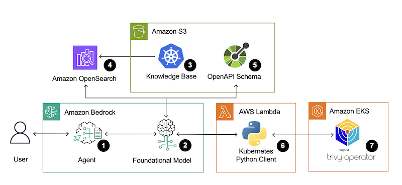
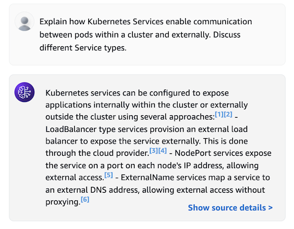
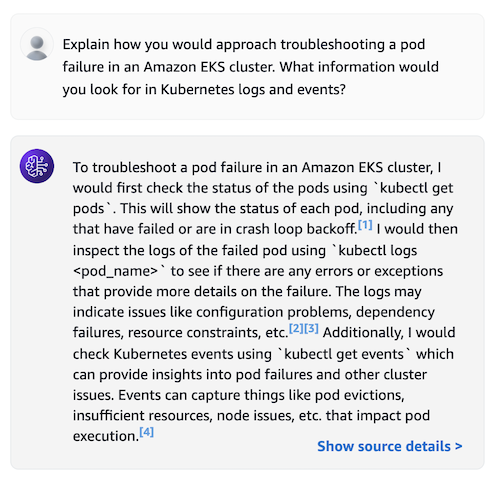
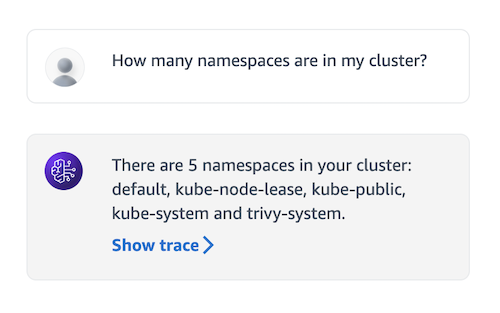
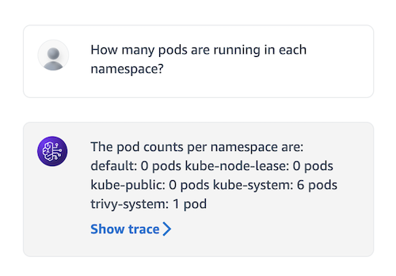
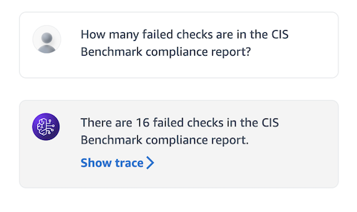
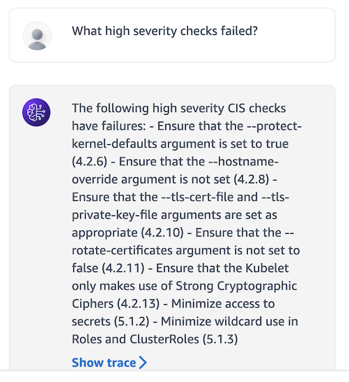

# Bedrock Agents For EKS

- 이 프로젝트는 AWS Samples의 [Bedrock Agents For EKS](https://github.com/aws-samples/bedrock-agents-for-eks)을 기반으로 한글화 및 일부 변경 되었습니다.

## 소개
[Amazon Bedrock 에이전트](https://docs.aws.amazon.com/ko_kr/bedrock/latest/userguide/agents.html)는 [Amazon Bedrock](https://docs.aws.amazon.com/ko_kr/bedrock/latest/userguide/what-is-bedrock.html)의 기능 중 하나로, 애플리케이션 내에서 작업을 자동화하기 위해 소프트웨어 에이전트를 구축하고 구성할 수 있게 해줍니다. 이러한 에이전트들은 [Anthropic Claude](https://docs.aws.amazon.com/ko_kr/bedrock/latest/userguide/model-parameters-claude.html)와 같은 [기본 모델](https://docs.aws.amazon.com/ko_kr/bedrock/latest/userguide/models-supported.html)을 활용하여 대화적인 프롬프트에 응답할 방법을 지능적으로 결정합니다. [검색 증강 생성(RAG)](https://aws.amazon.com/ko/what-is/retrieval-augmented-generation/)을 사용하여 도메인 특정 데이터 소스를 활용해 더 최신의 권위 있는 정보로 프롬프트에 응답할 수도 있습니다. 에이전트는 또한 [OpenAPI 스키마](https://docs.aws.amazon.com/ko_kr/bedrock/latest/userguide/agents-api-schema.html)와 [AWS Lambda 함수](https://docs.aws.amazon.com/ko_kr/bedrock/latest/userguide/agents-lambda.html)를 결합하여 외부 시스템에 지능적으로 접근하여 당신을 대신하여 작업을 완료할 수 있습니다.

이 게시물은 [Amazon EKS 클러스터](https://docs.aws.amazon.com/ko_kr/eks/latest/userguide/clusters.html)를 자연어로 제어할 수 있는 [Amazon Bedrock 에이전트](https://docs.aws.amazon.com/ko_kr/bedrock/latest/userguide/agents.html)를 구성하는 방법을 보여줍니다. Kubernetes 문서, Amazon EKS 문서, Knowledge Center의 EKS 문서를 데이터 소스로 사용하는 지식 베이스를 구성함으로써, 에이전트는 AWS에서 컨테이너 오케스트레이션과 관련된 특정 질문에 대답할 수 있습니다. 더 나아가, AWS Lambda 함수 내에서 [Kubernetes Python 클라이언트](https://github.com/kubernetes-client/python?tab=readme-ov-file#kubernetes-python-client)를 사용하는 방식으로 구성된 액션 그룹은 에이전트가 프롬프트에 따라 당신을 대신하여 Kubernetes API 서버에 쿼리를 수행하여 Amazon EKS 클러스터 리소스에 접근할 수 있게 합니다.

[Trivy](https://trivy.dev/)는 다양한 대상에서 취약점과 잘못된 구성을 찾기 위해 설계된 인기 있는 오픈 소스 보안 스캐너입니다. [Trivy Operator](https://github.com/aquasecurity/trivy-operator)는 Kubernetes 클러스터 내에 설치될 수 있으며, [Center for Internet Security (CIS) Kubernetes Benchmark](https://www.cisecurity.org/benchmark/kubernetes)를 기반으로 하는 일련의 점검을 수행할 수 있습니다. CIS 벤치마크는 Kubernetes 클러스터를 안전하게 유지하기 위한 최고의 실천 지침을 제시합니다. 이 게시물에서는 Amazon EKS 클러스터의 Kubernetes API 서버를 쿼리하도록 [Amazon Bedrock 에이전트](https://docs.aws.amazon.com/ko_kr/bedrock/latest/userguide/agents.html)를 구성하여, 에이전트와의 자연스러운 대화를 통해 [Trivy Operator](https://github.com/aquasecurity/trivy-operator)가 생성하는 CIS Kubernetes 벤치마크 보고서의 결과를 검토하는 방법을 추가로 시연합니다.


## 솔루션 개요

다음 다이어그램은 솔루션 아키텍처의 시각적 개요입니다:



1. 사용자는 자연어 입력 프롬프트를 에이전트에 제공합니다. 예를 들어, 사용자는 `"CIS 벤치마크 준수 보고서에서 실패한 체크가 몇 개 있습니까?"`라고 질문할 수 있습니다.
2. 에이전트는 사용자의 입력을 해석하기 위해 채팅 기록과 제공된 지침, 그리고 에이전트 생성 시 선택한 기본 모델의 조합을 사용합니다.
3. [지식 베이스](https://docs.aws.amazon.com/ko_kr/bedrock/latest/userguide/knowledge-base.html)는 완전히 관리되는 [검색 증강 생성(RAG)](https://aws.amazon.com/ko/what-is/retrieval-augmented-generation/)을 통해 기본 모델의 정확도와 성능을 향상시키는 데 사용됩니다. 이를 통해 기본 모델이 원래 학습되지 않은 도메인 특정 데이터를 검색할 수 있습니다. Kubernetes 및 Amazon EKS 문서는 데이터 소스로 업로드되어 에이전트가 전문적인 컨테이너 오케스트레이션 지식을 갖추게 합니다.
4. Amazon Bedrock은 자동으로 소스 데이터를 청크로 분할하고, 임베딩 모델을 사용하여 수치적 표현 또는 벡터로 변환합니다. 이 벡터는 벡터 인덱스에 저장됩니다. AWS 관리 콘솔을 통해 지식 베이스를 생성할 때 Amazon Bedrock은 [Amazon OpenSearch Serverless](https://docs.aws.amazon.com/ko_kr/opensearch-service/latest/developerguide/serverless-vector-search.html)에서 벡터 검색 컬렉션과 인덱스를 자동으로 생성하고 관리할 수 있습니다. 이 솔루션은 AWS CloudFormation 템플릿을 사용하여 OpenSearch Serverless에서 필요한 벡터 검색 컬렉션과 인덱스를 생성하지만, 지식 베이스는 [Amazon Aurora PostgreSQL](https://docs.aws.amazon.com/ko_kr/AmazonRDS/latest/AuroraUserGuide/AuroraPostgreSQL.VectorDB.html), [Pinecone](https://docs.pinecone.io/integrations/amazon-bedrock), [Redis Enterprise Cloud](https://redis.io/docs/latest/integrate/amazon-bedrock/), 그리고 [MongoDB Atlas](https://www.mongodb.com/ko-kr/docs/atlas/atlas-vector-search/ai-integrations/amazon-bedrock/)에서 생성된 벡터 인덱스를 활용할 수도 있습니다.
5. [OpenAPI 스키마](https://docs.aws.amazon.com/ko_kr/bedrock/latest/userguide/agents-api-schema.html)는 사용자 대신 에이전트가 호출할 수 있는 API 작업을 정의하기 위해 Amazon S3 버킷에 업로드됩니다.
6. [AWS Lambda 함수](https://docs.aws.amazon.com/ko_kr/bedrock/latest/userguide/agents-lambda.html)는 에이전트가 요청을 처리하고 올바르게 포맷된 응답 본문을 반환하기 위한 필요한 로직이 정의됩니다. OpenAPI 스키마와 AWS Lambda 함수는 [액션 그룹](https://docs.aws.amazon.com/ko_kr/bedrock/latest/userguide/agents-action-create.html) 자원에서 함께 사용됩니다. 이 솔루션은 [Kubernetes Python 클라이언트](https://github.com/kubernetes-client/python)를 사용하여 AWS Lambda 함수가 Amazon EKS 클러스터의 Kubernetes API 서버에 쿼리를 수행할 수 있도록 합니다.
7. [Trivy Operator](https://github.com/aquasecurity/trivy-operator)는 [CIS Kubernetes 벤치마크](https://www.cisecurity.org/benchmark/kubernetes) 보고서를 [ClusterComplianceReport](https://aquasecurity.github.io/trivy-operator/latest/docs/crds/clustercompliance-report/) 사용자 지정 리소스로 생성하며, 이 보고서의 결과는 사용자 입력에 따라 에이전트가 검색할 수 있습니다.


## 시작하기

### 사전 준비 사항

이 솔루션을 배포하려면 다음 도구들이 필요합니다:
- [AWS CLI 설치 가이드](https://docs.aws.amazon.com/ko_kr/cli/latest/userguide/getting-started-install.html)
- [eksctl 설치 가이드](https://eksctl.io/installation/)
- [kubectl 설치 가이드](https://kubernetes.io/docs/tasks/tools/)
- [Helm 설치 가이드](https://helm.sh/docs/intro/install/)
- [Git 설치 가이드](https://github.com/git-guides/install-git)

또한 [Bedrock Foundation Models에 액세스 요청](https://docs.aws.amazon.com/ko_kr/bedrock/latest/userguide/model-access.html#model-access-add)이 필요합니다. [Amazon Titan Text Embeddings V2 모델](https://docs.aws.amazon.com/ko_kr/bedrock/latest/userguide/titan-embedding-models.html)와 [Anthropic Claude 3.5 Sonnet 모델](https://docs.aws.amazon.com/ko_kr/bedrock/latest/userguide/model-parameters-claude.html)에 액세스할 수 있어야 합니다.

### Amazon EKS 클러스터 설정

기존의 Amazon EKS 클러스터와 이 솔루션을 구성할 수 있지만, 초기 테스트 및 실험에는 개발 환경만 대상으로 해야 합니다.

[eksctl](https://eksctl.io/usage/creating-and-managing-clusters/) CLI 도구를 사용하여 새로운 Amazon EKS 클러스터를 배포하기 위해 다음 명령어를 실행합니다:

```
eksctl create cluster --name devocean-agent-eks --region us-east-1
```
[eksctl](https://eksctl.io/usage/creating-and-managing-clusters/) CLI 도구는 기본적으로 `~/.kube/config`에 kubernetes 구성을 자동으로 추가합니다. Amazon EKS 클러스터에 액세스할 수 있는지 확인하려면 다음 kubectl 명령어를 실행합니다:
 ```
kubectl get nodes
 ```

그 다음, Helm을 사용하여 [Trivy Operator](https://github.com/aquasecurity/trivy-operator)를 설치합니다.:

 ```
helm repo add aqua https://aquasecurity.github.io/helm-charts/

helm repo update
   
helm install trivy-operator aqua/trivy-operator \
  --namespace trivy-system \
  --create-namespace \
  --version 0.21.0-rc \
  --set="compliance.cron=*/10 * * * *"
```

기본적으로 Trivy Operator는 6시간마다 컴플라이언스 보고서를 생성합니다. 여기서 `compliance.cron` 설정을 10분마다 보고서를 생성하도록 업데이트했습니다 (디모용).

Trivy Operator가 성공적으로 설치되었는지 확인하려면 [CIS ClusterComplianceReport](https://aquasecurity.github.io/trivy-operator/latest/docs/crds/clustercompliance-report/)를 직접 요청합니다:


```
kubectl get clustercompliancereport cis -o yaml
```
나중에 Amazon Bedrock Agent는 이 보고서를 당신 대신에 가져와서 분석할 것입니다.

## 지식베이스 데이터 소스 준비
아마존 S3 버킷을 생성하여 지식베이스의 데이터 소스를 저장합니다:
```
AWS_ACCOUNT=$(aws sts get-caller-identity --query "Account" --output text)
```
```
aws s3 mb s3://eks-bedrock-knowledge-base-data-source-${AWS_ACCOUNT} \
  --region us-east-1
```

그 다음으로, 필요한 참조 문서를 저장할 로컬 디렉토리를 생성합니다. 이 솔루션은 [Kubernetes Documentation](https://github.com/kubernetes/website/tree/main/content/en), [Amazon EKS Best Practices Guide](https://github.com/aws/aws-eks-best-practices), [Amazon EKS User Guide](https://docs.aws.amazon.com/pdfs/eks/latest/userguide/eks-ug.pdf), [Amazon EKS API Reference](https://docs.aws.amazon.com/pdfs/eks/latest/APIReference/eks-api.pdf)를 데이터 소스로 사용합니다.

```
mkdir data_sources

# Get the Kubernetes Documentation: 
git clone git@github.com:kubernetes/website.git    
cp -r website/content/en data_sources/kubernetes_docs

# Get the Amazon EKS Best Practices Guide:
git clone git@github.com:aws/aws-eks-best-practices.git
cp -r aws-eks-best-practices data_sources/eks_best_practices

cd data_sources

# Get the Amazon EKS User Guide: 
curl https://docs.aws.amazon.com/pdfs/eks/latest/userguide/eks-ug.pdf \
 -o eks-user-guide.pdf

# Get the Amazon EKS API Reference: 
curl https://docs.aws.amazon.com/pdfs/eks/latest/APIReference/eks-api.pdf \
-o eks-api-ref.pdf
```

추가 데이터 소스를 추가하려면, [지원하는 파일 형식](https://docs.aws.amazon.com/bedrock/latest/userguide/knowledge-base-ds.html)을 확인하고 각 파일의 크기가 50 MB 제한을 초과하지 않도록 합니다.

마지막으로, [aws s3 sync](https://awscli.amazonaws.com/v2/documentation/api/latest/reference/s3/sync.html) 명령어를 사용하여 데이터 소스를 대상 Amazon S3 버킷으로 복사합니다. `--exclude`와 `--include` 플래그를 조합하여 지원되지 않는 파일 형식을 제외하도록 필터링합니다.

```
aws s3 sync ~/data_sources s3://eks-bedrock-knowledge-base-data-source-${AWS_ACCOUNT} \
 --region us-east-1 \
 --exclude "*" \
 --include "*.txt" \
 --include "*.md" \
 --include "*.html" \
 --include "*.pdf" 
```

## Action Group OpenAPI 스키마 준비하기

솔루션 저장소를 복제합니다:

```
git clone git@github.com:aws-samples/bedrock-agents-for-eks.gits
```

이 저장소에는 액션 그룹의 일부로 사용될 사전 구성된 OpenAPI 스키마 (`open-api-schema.json`)가 포함되어 있습니다. 이 스키마는 에이전트가 수행할 수 있는 API 작업을 지정하는 데 사용됩니다. 나중에 참조할 수 있도록 이를 Amazon S3 버킷에 복사합니다:

```
# Create an S3 Bucket 
aws s3 mb s3://eks-bedrock-agent-openapi-schema-${AWS_ACCOUNT} \
 --region us-east-1
  
cd bedrock-agents-for-eks

aws s3 cp open-api-schema.json s3://eks-bedrock-agent-openapi-schema-${AWS_ACCOUNT} \
 --region us-east-1
```

## AWS Lambda 함수 아티팩트 준비
이 솔루션은 두 개의 AWS Lambda 함수를 사용합니다. `CustomResourceFunction`은 OpenSearch Serverless 컬렉션에 필요한 벡터 인덱스를 생성하고, `ActionGroupFunction`은 에이전트가 EKS 클러스터에 프로그래밍 방식으로 접근할 수 있도록 하는 프록시 역할을 합니다. `lambda-build.sh` 스크립트를 실행하여 AWS CloudFormation 템플릿에서 참조하는 AWS Lambda 아티팩트를 설치하고 패키징하여 새로 생성된 S3 버킷에 저장합니다:

```
./lambda-build.sh
```

## 스택 배포하기

패키지화된 AWS CloudFormation 템플릿을 배포합니다:

```
aws cloudformation deploy \
 --template-file packaged-devocean-agents-for-eks-cfn.yaml \
 --stack-name devocean-agents-for-eks-stack \
 --capabilities CAPABILITY_NAMED_IAM \
 --region us-east-1
```

## EKS 클러스터 접근 구성

`ActionGroupFunction`은 EKS 클러스터에 읽기 전용 액세스 권한이 필요합니다. `kube-setup.sh` 스크립트를 실행하여 필요한 ClusterRole과 ClusterRoleBinding 객체를 생성하고 aws-auth ConfigMap을 업데이트합니다:

기본 `CLUSTER_NAME`은 `devocean-agent-eks`로 설정되어 있습니다. 다른 EKS 클러스터를 사용하는 경우 스크립트를 실행하기 전에 값을 업데이트해야 합니다.
```
./kube-setup.sh
```
```
kubectl get cm aws-auth -n kube-system -oyaml
```

## 지식베이스 테스트

Amazon Bedrock 대시보드에 내장된 채팅 인터페이스를 사용하여 에이전트 지식베이스와 액션 그룹을 테스트할 수 있습니다. 먼저, [문서 안내](https://docs.aws.amazon.com/bedrock/latest/userguide/knowledge-base-ingest.html)를 따라 Amazon S3 버킷에서 데이터 소스를 동기화해야 합니다. 동기화 과정은 데이터 소스의 원시 데이터를 벡터 임베딩으로 변환한 후 지식베이스에 적재합니다.

동기화 과정이 완료되면, [문서 안내](https://docs.aws.amazon.com/bedrock/latest/userguide/kb-test-how.html)를 따라 지식베이스에 대한 테스트 쿼리를 발행할 수 있습니다. 지식베이스 테스트에는 여러 기본 모델 중에서 배포된 에이전트의 기본 구성과 일치하도록 `Anthropic Claude 3 Sonnet` 모델을 선택합니다.

내장된 채팅 인터페이스를 사용하여 Kubernetes 및 EKS 도메인별 지식에 접근할 수 있는 일련의 쿼리를 실행하여 접근성을 확인합니다. 예를 들어:




Amazon S3에 있는 특정 참조 데이터 소스 파일을 가리키는 소스 청크 및 메타데이터를 보려면 `소스 세부 정보 표시`를 클릭할 수 있습니다.

## 에이전트 테스트

Bedrock 에이전트의 작동 초안을 준비하고 테스트하려면 [문서 안내](https://docs.aws.amazon.com/bedrock/latest/userguide/agents-test.html)에 따라 진행합니다.

Bedrock 에이전트가 EKS 클러스터에 대한 쿼리를 수행할 수 있는지 확인합니다. 네임스페이스, 포드, CIS 벤치마크 규정 준수 보고서 확인과 관련된 질문을 예로 들면:






Bedrock 에이전트는 특정 정보에 대한 EKS 클러스터 쿼리 시점을 지능적으로 해석하여 Trivy Operator가 생성하는 CIS 벤치마크 규정 준수 보고서 정보를 가져옵니다.


## 정리 작업

AWS 계정에서 요금이 청구되지 않도록 이 솔루션에서 프로비저닝된 리소스를 정리합니다.

EKS 클러스터에서 ClusterRole과 ClusterRoleBinding 객체를 삭제하고 aws-auth ConfigMap에서 식별 매핑을 제거하려면 `kube-down.sh` 스크립트를 실행합니다:


```
./kube-down.sh
```
```
kubectl get cm aws-auth -n kube-system -oyaml
```

Trivy Operator를 제거합니다:


```
helm uninstall trivy-operator -n trivy-system
```

추가적으로, [Trivy 문서](https://aquasecurity.github.io/trivy-operator/v0.19.4/getting-started/installation/helm/#uninstall)를 따라 사용자 정의 리소스 정의를 삭제하되, 이는 오퍼레이터가 생성한 모든 보안 보고서도 함께 삭제됨을 주의합니다.

해당 솔루션의 테스트를 위해 생성한 EKS 클러스터를 선택적으로 삭제할 수 있습니다:


 ```
eksctl delete cluster \
 --name devocean-agent-eks \
 --region us-east-1
 ```

AWS CloudFormation 스택을 삭제합니다:

 ```
 aws cloudformation delete-stack \
 --stack-name devocean-agents-for-eks-stack \
 --region us-east-1
 ```

마지막으로, 데이터 소스, OpenAPI 스키마 및 AWS Lambda 함수 아티팩트를 저장하는 데 사용된 Amazon S3 버킷을 비우고 삭제합니다:


 ```
aws s3 rm s3://eks-bedrock-knowledge-base-data-source-${AWS_ACCOUNT}/ \
 --recursive \
 --region us-east-1
  
aws s3 rb s3://eks-bedrock-knowledge-base-data-source-${AWS_ACCOUNT} \
 --region us-east-1
 
aws s3 rm s3://eks-bedrock-agent-openapi-schema-${AWS_ACCOUNT}/ \
 --recursive \
 --region us-east-1
 
aws s3 rb s3://eks-bedrock-agent-openapi-schema-${AWS_ACCOUNT} \
 --region us-east-1
 
aws s3 rm s3://bedrock-agent-lambda-artifacts-${AWS_ACCOUNT}/ \
 --recursive \
 --region us-east-1
 
aws s3 rb s3://bedrock-agent-lambda-artifacts-${AWS_ACCOUNT} \
 --region us-east-1
 ```

## 결론
[Amazon Bedrock Agents](https://docs.aws.amazon.com/bedrock/latest/userguide/agents.html)는 [Anthropic Claude](https://docs.aws.amazon.com/bedrock/latest/userguide/model-parameters-claude.html)와 같은 [기초 모델](https://docs.aws.amazon.com/bedrock/latest/userguide/models-supported.html)을 활용하여 [Amazon EKS 클러스터](https://docs.aws.amazon.com/eks/latest/userguide/clusters.html)에 대한 새로운 자연어 인터페이스 역할을 수행할 수 있습니다. [액션 그룹](https://docs.aws.amazon.com/bedrock/latest/userguide/agents-action-create.html)을 통해 Kubernetes API 서버를 지능적으로 쿼리하여 Bedrock 에이전트는 대화형 질의에 응답하는 과정에서 클러스터별 정보를 보다 인간이 이해하기 쉬운 형태로 전달할 수 있습니다. 이 글은 Trivy Operator가 생성한 [CIS 벤치마크 규정 준수 보고서](https://www.cisecurity.org/benchmark/kubernetes) 결과를 검색하도록 에이전트를 유도하여 이러한 에이전트 능력을 시연했지만, 이 솔루션은 EKS 클러스터 및 Kubernetes 자원에 대한 접근을 자연스러운 대화를 통해 더욱 폭넓게 확대하여 새로운 배포 패턴과 클러스터 관리 패러다임을 만들어 갈 수 있는 기회를 제공합니다.